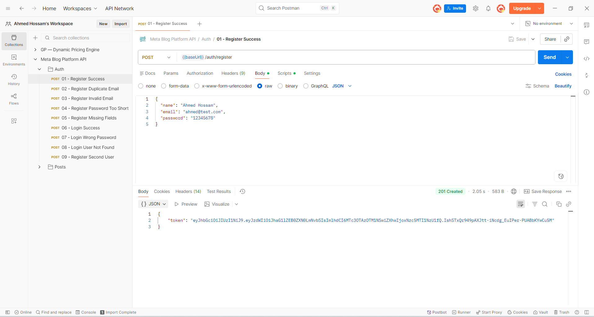
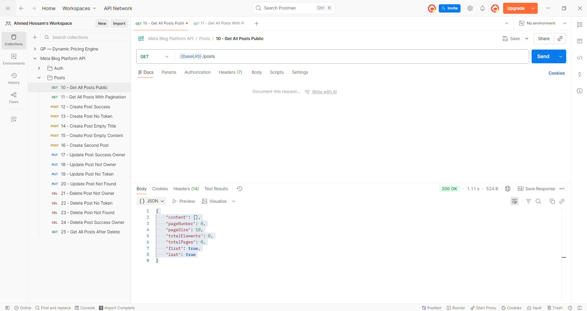
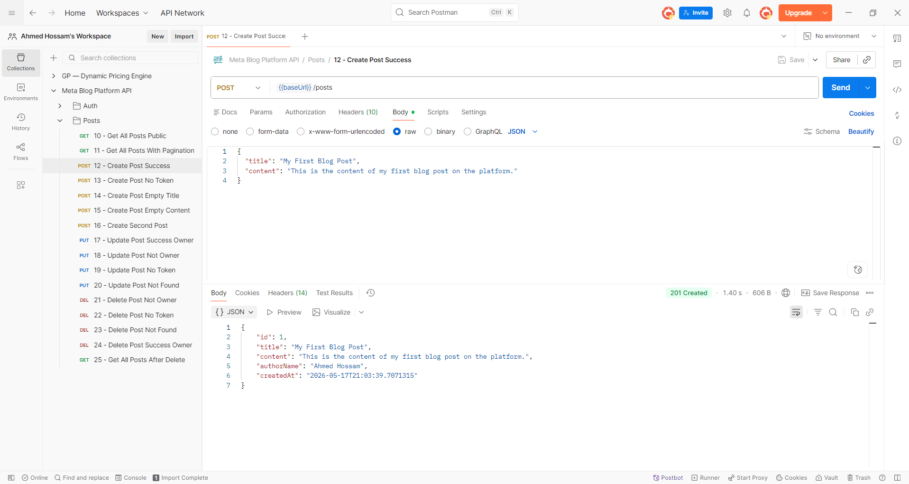
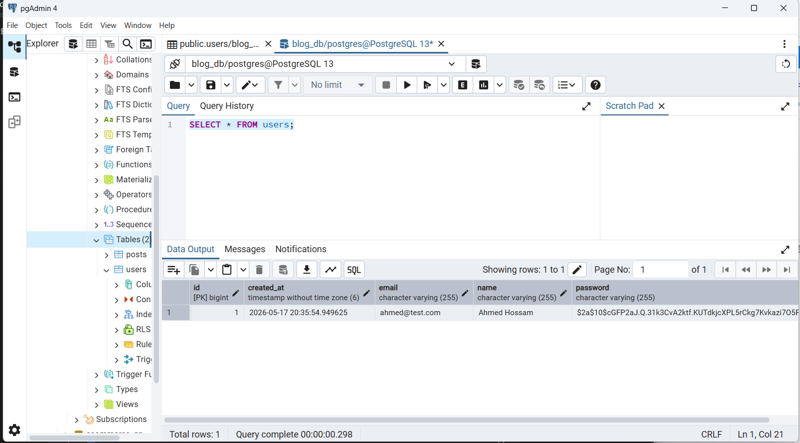

# meta-blog-platform-api

RESTful Blogging Platform API built with Spring Boot — Meta Software Internship Task 2026.

**GitHub:** [ahmedhossam32/meta-blog-platform-api](https://github.com/ahmedhossam32/meta-blog-platform-api)

---

## Tech Stack

| Layer | Technology |
|---|---|
| Language | Java 17 |
| Framework | Spring Boot 3.2.5 |
| Database | PostgreSQL |
| Auth | Spring Security + JWT (jjwt 0.11.5) |
| ORM | Spring Data JPA + Hibernate |
| Utilities | Lombok, Bean Validation |
| Build | Maven |

---

## Why PostgreSQL

Posts and users have a clear relational structure — a post belongs to a user, and that ownership is enforced at the API level. PostgreSQL fits naturally here: foreign key constraints, ACID guarantees, and native support for pagination queries (`LIMIT`/`OFFSET`) make it the right tool for a structured, write-consistent blogging API. A document store would be overkill and would give up referential integrity for no benefit.

---

## Project Structure

```
src/main/java/com/meta/blogapi/
├── config/          # Security configuration
├── controller/      # API endpoints
├── dto/             # Request & response objects
├── entity/          # JPA entities (User, Post)
├── exception/       # Custom exceptions & global handler
├── repository/      # Database queries
├── security/        # JWT filter & service
└── service/         # Business logic
```

---

## Setup

### Prerequisites

- Java 17
- Maven
- PostgreSQL

### Steps

**1. Clone the repository**

```bash
git clone https://github.com/ahmedhossam32/meta-blog-platform-api.git
cd meta-blog-platform-api
```

**2. Create the database**

```sql
CREATE DATABASE blog_db;
```

**3. Configure application properties**

```bash
cp src/main/resources/application-example.properties src/main/resources/application.properties
```

Open `application.properties` and fill in your credentials:

```properties
spring.datasource.url=jdbc:postgresql://localhost:5432/blog_db
spring.datasource.username=YOUR_DB_USERNAME
spring.datasource.password=YOUR_DB_PASSWORD

jwt.secret=YOUR_JWT_SECRET
```

**4. Run the application**

```bash
./mvnw spring-boot:run
```

The API will be available at `http://localhost:8080`.

---

## API Endpoints

| Method | Endpoint | Access | Description |
|---|---|---|---|
| `POST` | `/auth/register` | Public | Register a new user |
| `POST` | `/auth/login` | Public | Login and receive JWT token |
| `GET` | `/posts?page=0&size=10` | Public | Get all posts (paginated) |
| `POST` | `/posts` | Protected | Create a new post |
| `PUT` | `/posts/{id}` | Protected | Update a post (owner only) |
| `DELETE` | `/posts/{id}` | Protected | Delete a post (owner only) |

---

## Authentication

Protected endpoints require a valid JWT token in the `Authorization` header.

```
Authorization: Bearer <token>
```

Obtain a token by calling `POST /auth/login` with valid credentials. The token is returned in the response body and must be included in all subsequent requests to protected routes.

---

## Error Responses

All errors follow a consistent JSON format:

```json
{
  "status": 404,
  "message": "Post not found with id: 5",
  "timestamp": "2026-05-17T20:00:00"
}
```

| Status Code | Meaning |
|---|---|
| `400 Bad Request` | Validation error |
| `401 Unauthorized` | Invalid or missing credentials |
| `403 Forbidden` | Authenticated but not the post owner |
| `404 Not Found` | Resource does not exist |
| `409 Conflict` | Email already registered |
| `500 Internal Server Error` | Unexpected server error |

---

## API in Action


> POST /auth/register — 201 Created. User registered and JWT token returned.


> GET /posts — 200 OK. Public endpoint returns paginated posts list.


> POST /posts — 201 Created. Authenticated user creates a new post.


> PostgreSQL users table — passwords stored as BCrypt hashes, never plain text.

---

## Testing Documentation

For a full walkthrough of all 25 test cases and screenshots, refer to:
[docs/TESTING.md](docs/TESTING.md)

The Postman collection covering all scenarios is available at:
[docs/postman/blog-api-collection.json](docs/postman/blog-api-collection.json)