# Testing Documentation

## Overview

This document covers all 25 test cases for the Meta Blog Platform API.
Each test includes the endpoint, scenario, expected result, and a screenshot reference.

## How to Run Tests

1. Import `docs/postman/blog-api-collection.json` into Postman
2. Run **01 - Register Success** first to auto-save the JWT token
3. Run **09 - Register Second User** to auto-save the second JWT token
4. Run tests in order 01 to 25

---

## Auth Endpoints

### 01 - Register Success
- **Method:** POST
- **Endpoint:** /auth/register
- **Scenario:** Valid registration with name, email and password
- **Expected:** 201 Created + JWT token
- **Screenshot:** 

---

### 02 - Register Duplicate Email
- **Method:** POST
- **Endpoint:** /auth/register
- **Scenario:** Same email registered twice
- **Expected:** 409 Conflict + error message
- **Screenshot:** 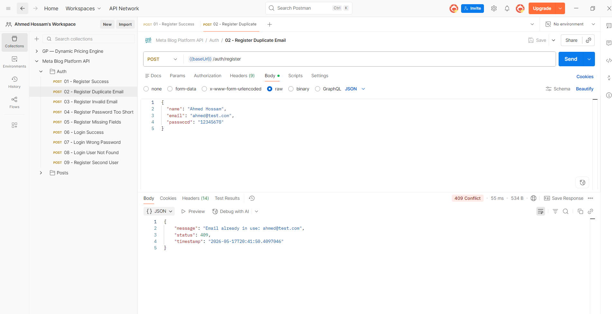

---

### 03 - Register Invalid Email
- **Method:** POST
- **Endpoint:** /auth/register
- **Scenario:** Email field contains invalid format
- **Expected:** 400 Bad Request + validation error
- **Screenshot:** 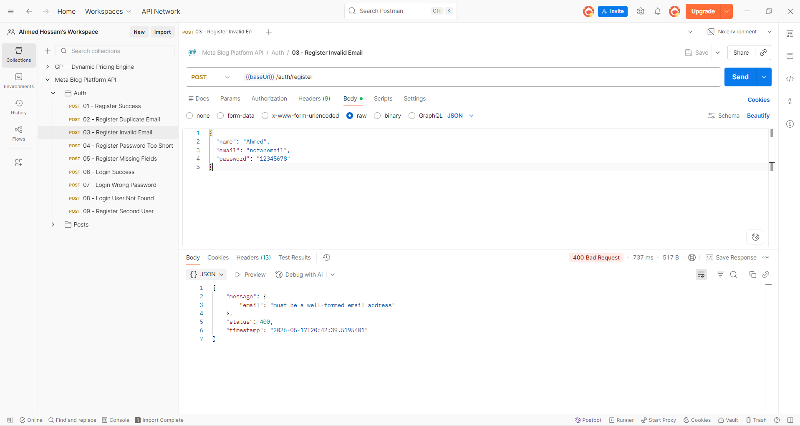

---

### 04 - Register Password Too Short
- **Method:** POST
- **Endpoint:** /auth/register
- **Scenario:** Password less than 8 characters
- **Expected:** 400 Bad Request + validation error
- **Screenshot:** 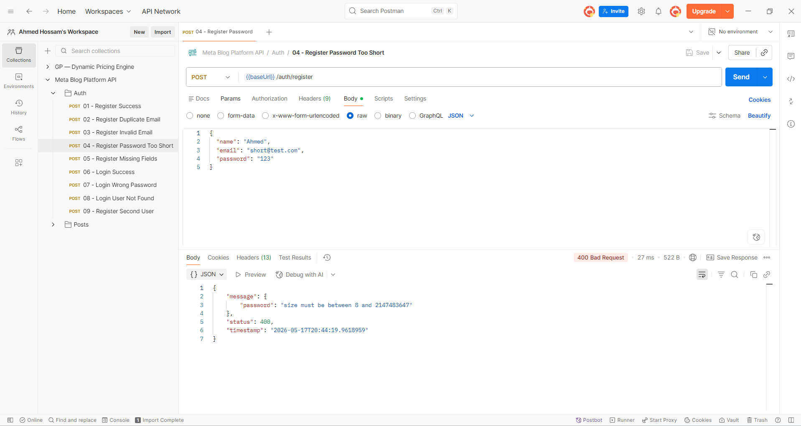

---

### 05 - Register Missing Fields
- **Method:** POST
- **Endpoint:** /auth/register
- **Scenario:** Empty name, email and password
- **Expected:** 400 Bad Request + validation errors for all fields
- **Screenshot:** 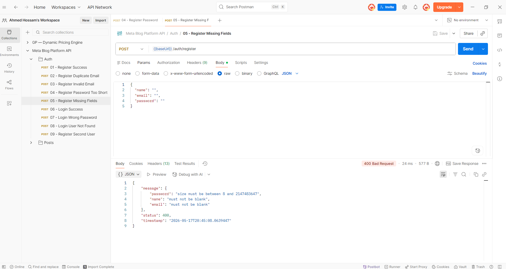

---

### 06 - Login Success
- **Method:** POST
- **Endpoint:** /auth/login
- **Scenario:** Valid credentials
- **Expected:** 200 OK + JWT token
- **Screenshot:** 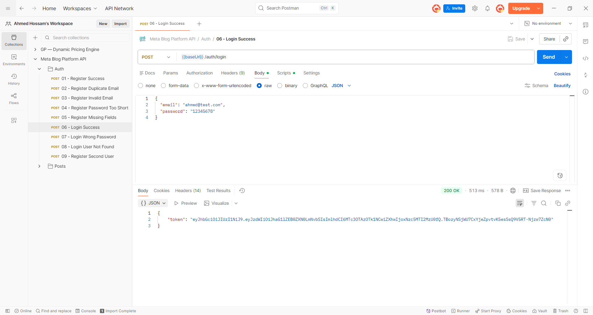

---

### 07 - Login Wrong Password
- **Method:** POST
- **Endpoint:** /auth/login
- **Scenario:** Correct email but wrong password
- **Expected:** 401 Unauthorized
- **Screenshot:** 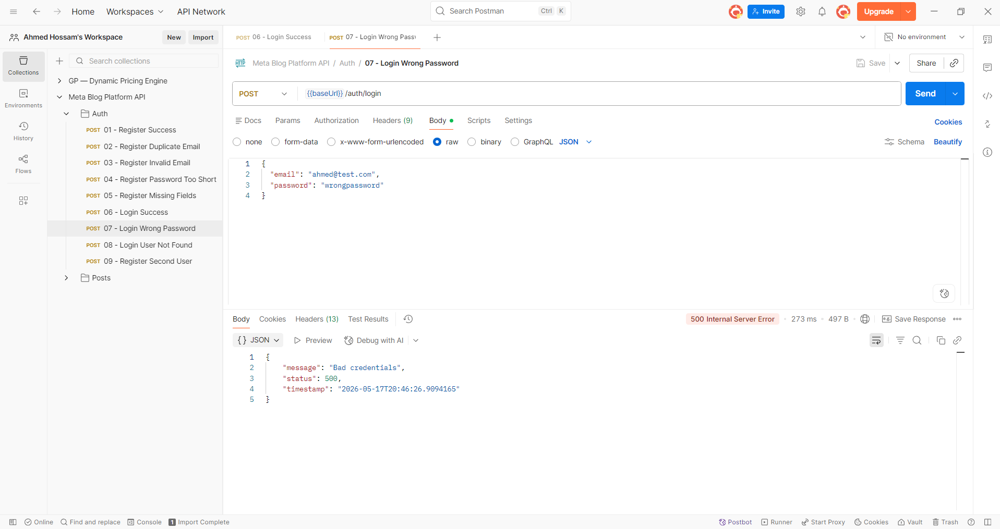

---

### 08 - Login User Not Found
- **Method:** POST
- **Endpoint:** /auth/login
- **Scenario:** Email does not exist in the database
- **Expected:** 401 Unauthorized
- **Screenshot:** 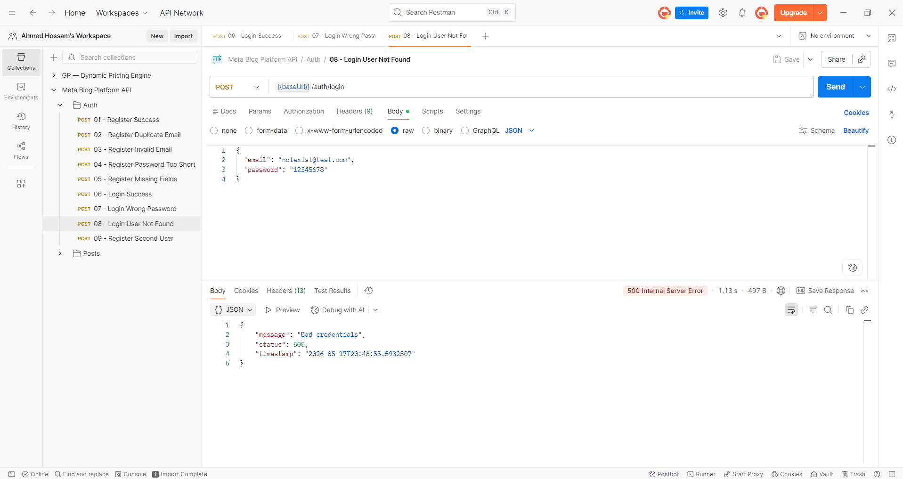

---

### 09 - Register Second User
- **Method:** POST
- **Endpoint:** /auth/register
- **Scenario:** Register a second user for ownership tests
- **Expected:** 201 Created + JWT token saved as token2
- **Screenshot:** 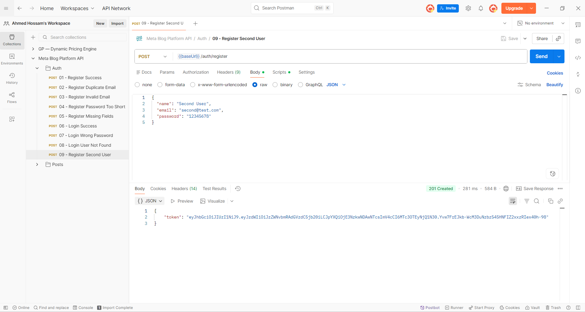

---

## Posts Endpoints

### 10 - Get All Posts Public
- **Method:** GET
- **Endpoint:** /posts
- **Scenario:** No token required, fetch all posts
- **Expected:** 200 OK + paginated response
- **Screenshot:** 

---

### 11 - Get All Posts With Pagination
- **Method:** GET
- **Endpoint:** /posts?page=0&size=5
- **Scenario:** Fetch posts with custom page size
- **Expected:** 200 OK + pageSize: 5 in response
- **Screenshot:** 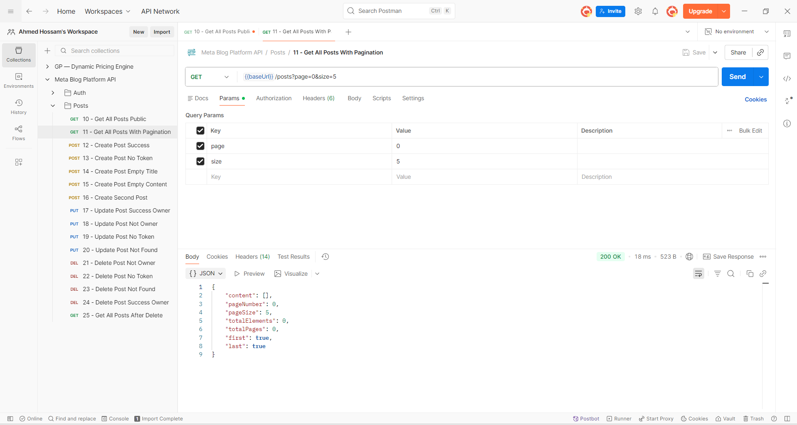

---

### 12 - Create Post Success
- **Method:** POST
- **Endpoint:** /posts
- **Scenario:** Authenticated user creates a post
- **Expected:** 201 Created + post object with authorName
- **Screenshot:** 

---

### 13 - Create Post No Token
- **Method:** POST
- **Endpoint:** /posts
- **Scenario:** Request sent without Authorization header
- **Expected:** 403 Forbidden
- **Screenshot:** 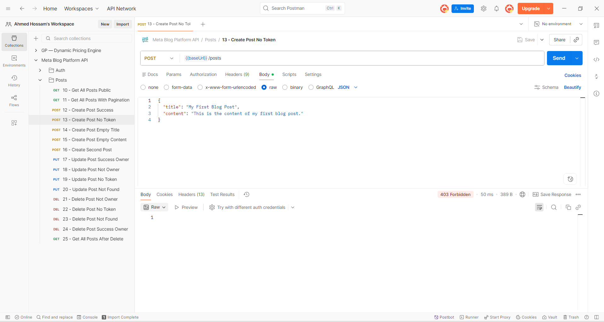

---

### 14 - Create Post Empty Title
- **Method:** POST
- **Endpoint:** /posts
- **Scenario:** Title field is empty
- **Expected:** 400 Bad Request + validation error
- **Screenshot:** 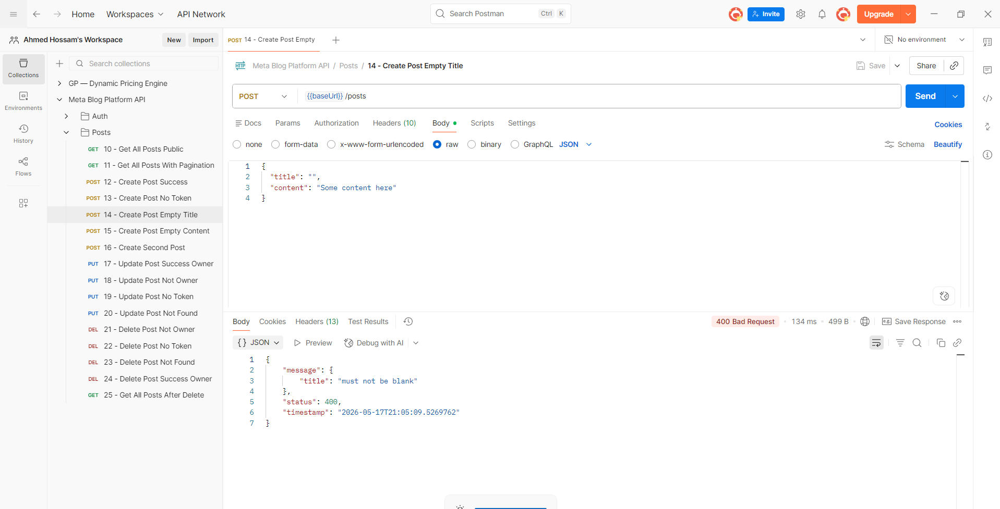

---

### 15 - Create Post Empty Content
- **Method:** POST
- **Endpoint:** /posts
- **Scenario:** Content field is empty
- **Expected:** 400 Bad Request + validation error
- **Screenshot:** 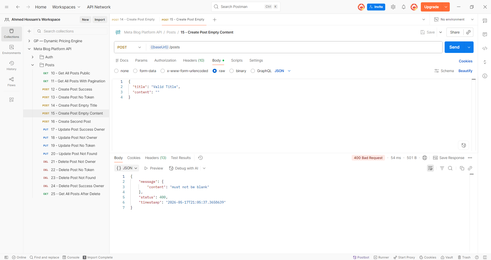

---

### 16 - Create Second Post
- **Method:** POST
- **Endpoint:** /posts
- **Scenario:** Authenticated user creates a second post
- **Expected:** 201 Created
- **Screenshot:** 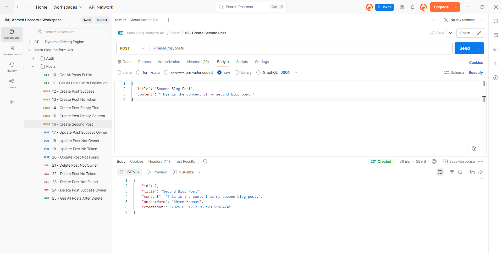

---

### 17 - Update Post Success Owner
- **Method:** PUT
- **Endpoint:** /posts/{id}
- **Scenario:** Owner updates their own post
- **Expected:** 200 OK + updated post object
- **Screenshot:** 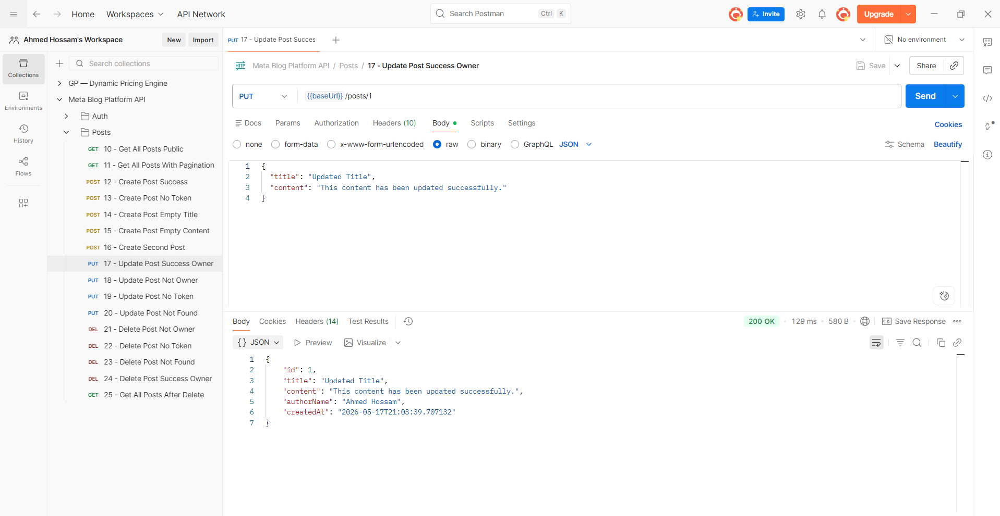

---

### 18 - Update Post Not Owner
- **Method:** PUT
- **Endpoint:** /posts/{id}
- **Scenario:** Second user tries to update post owned by first user
- **Expected:** 403 Forbidden + access denied message
- **Screenshot:** 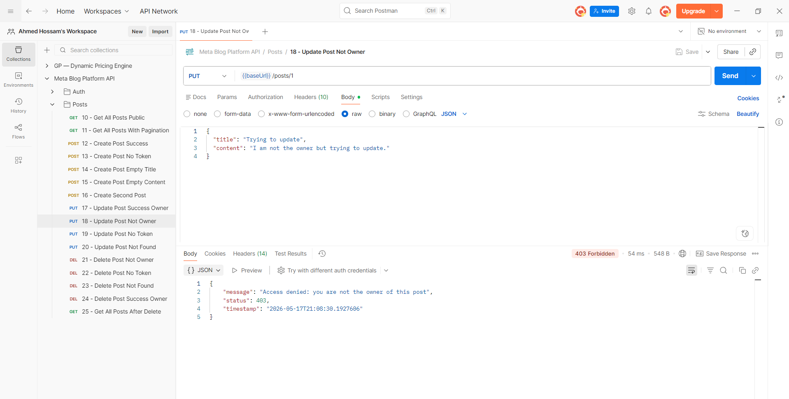

---

### 19 - Update Post No Token
- **Method:** PUT
- **Endpoint:** /posts/{id}
- **Scenario:** Update request sent without token
- **Expected:** 403 Forbidden
- **Screenshot:** 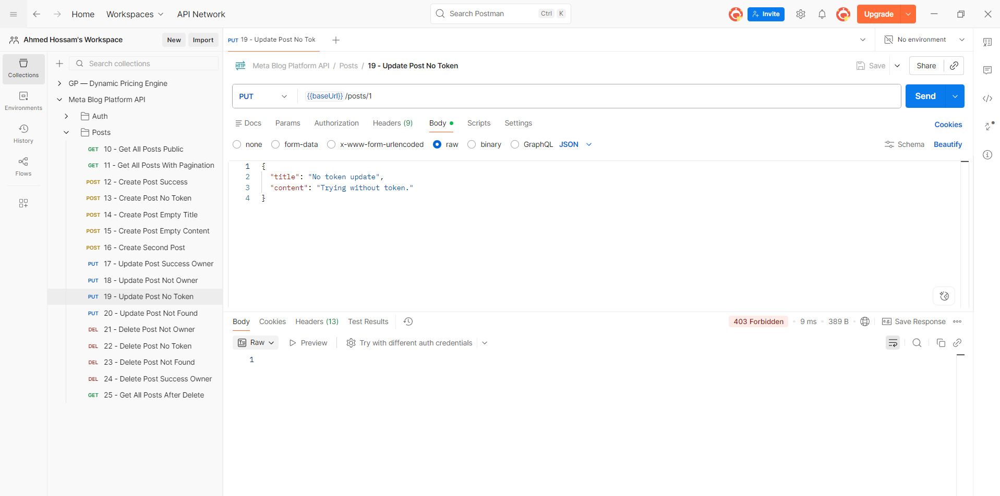

---

### 20 - Update Post Not Found
- **Method:** PUT
- **Endpoint:** /posts/9999
- **Scenario:** Post ID does not exist
- **Expected:** 404 Not Found + error message
- **Screenshot:** 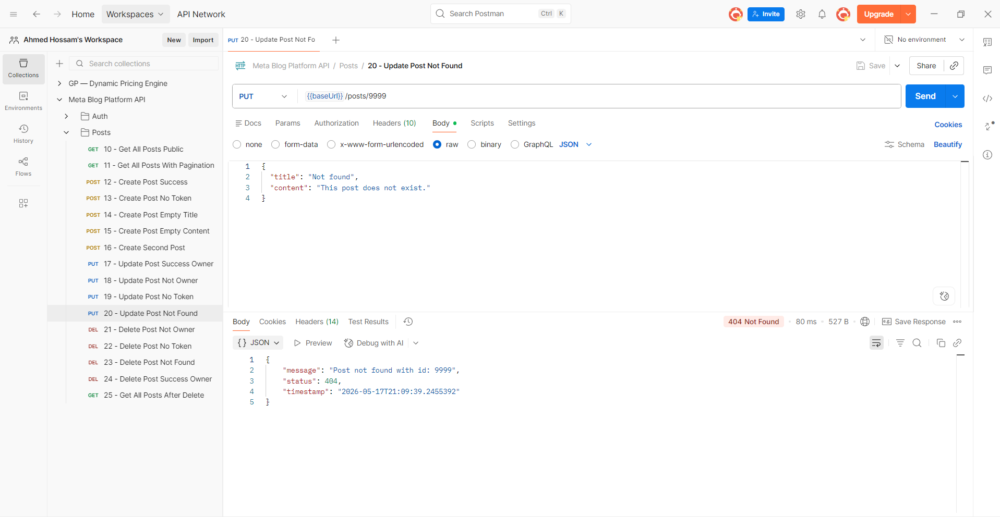

---

### 21 - Delete Post Not Owner
- **Method:** DELETE
- **Endpoint:** /posts/{id}
- **Scenario:** Second user tries to delete post owned by first user
- **Expected:** 403 Forbidden + access denied message
- **Screenshot:** 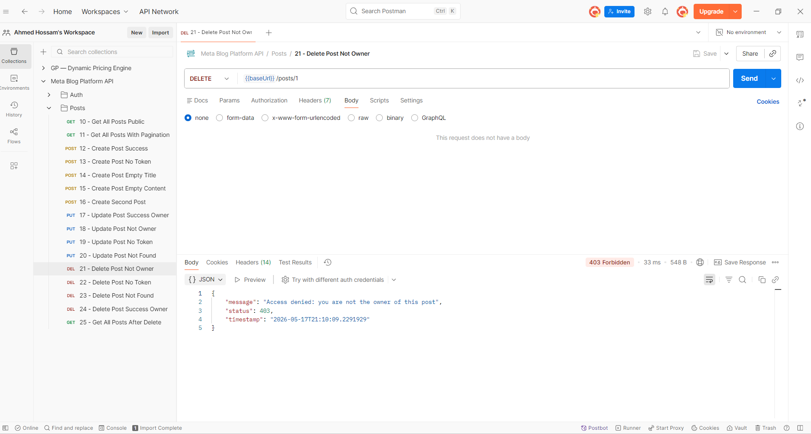

---

### 22 - Delete Post No Token
- **Method:** DELETE
- **Endpoint:** /posts/{id}
- **Scenario:** Delete request sent without token
- **Expected:** 403 Forbidden
- **Screenshot:** 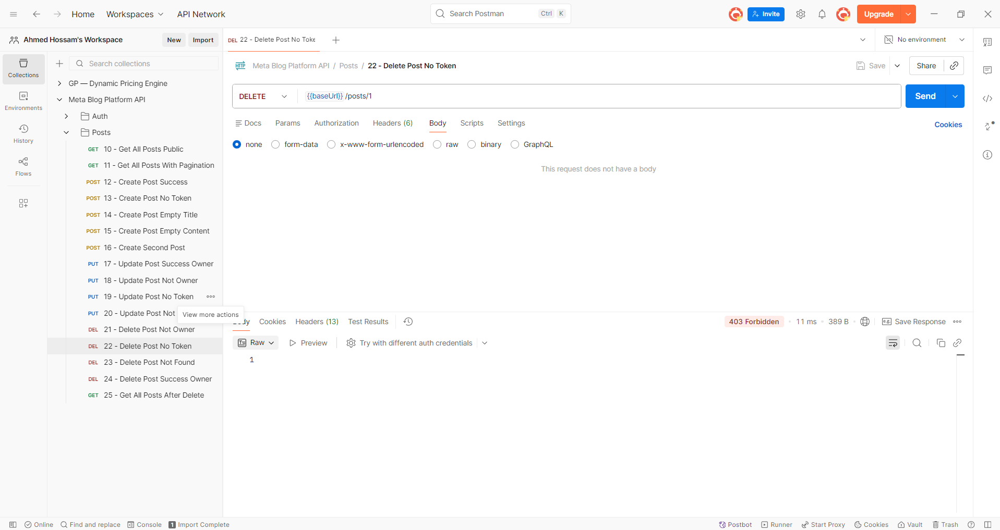

---

### 23 - Delete Post Not Found
- **Method:** DELETE
- **Endpoint:** /posts/9999
- **Scenario:** Post ID does not exist
- **Expected:** 404 Not Found + error message
- **Screenshot:** 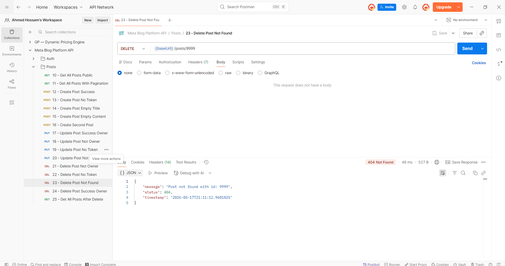

---

### 24 - Delete Post Success Owner
- **Method:** DELETE
- **Endpoint:** /posts/{id}
- **Scenario:** Owner deletes their own post
- **Expected:** 200 OK + "Post deleted successfully" message
- **Screenshot:** 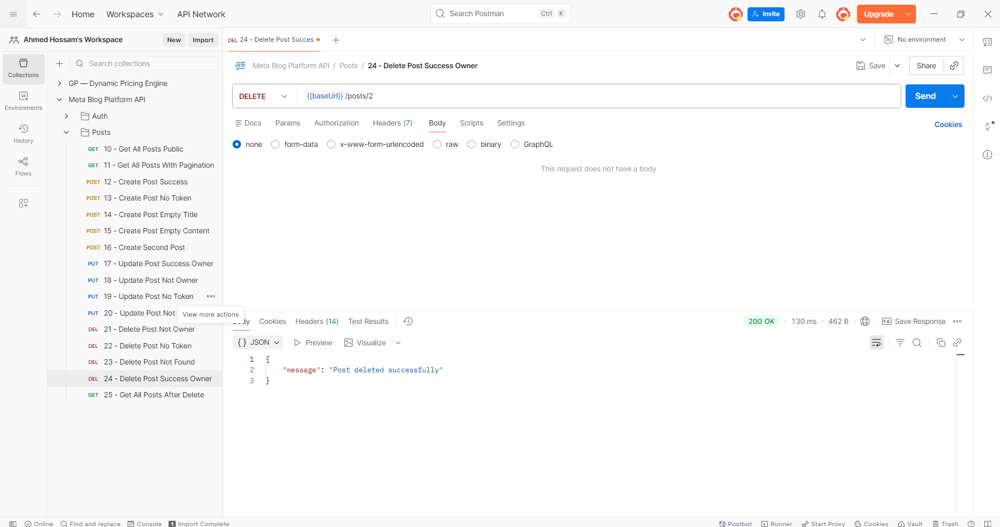

---

### 25 - Get All Posts After Delete
- **Method:** GET
- **Endpoint:** /posts
- **Scenario:** Verify post count decreased after deletion
- **Expected:** 200 OK + one less post in content array
- **Screenshot:** 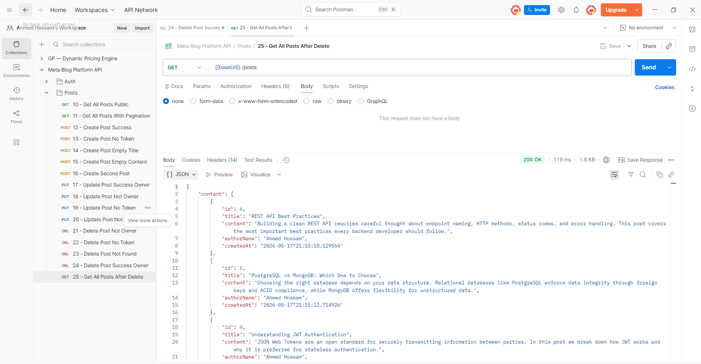

---

## Database Verification

### Users Table
Shows all registered users with BCrypt hashed passwords.

---

### Two Users Registered
Shows both users after running test 09.
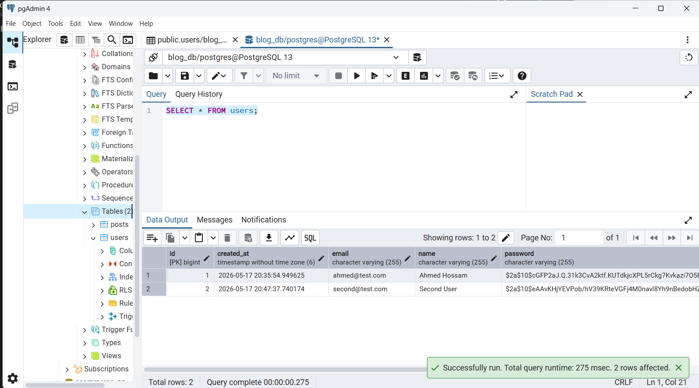

---

### Posts Table
Shows all created posts with author_id foreign key linking to users.
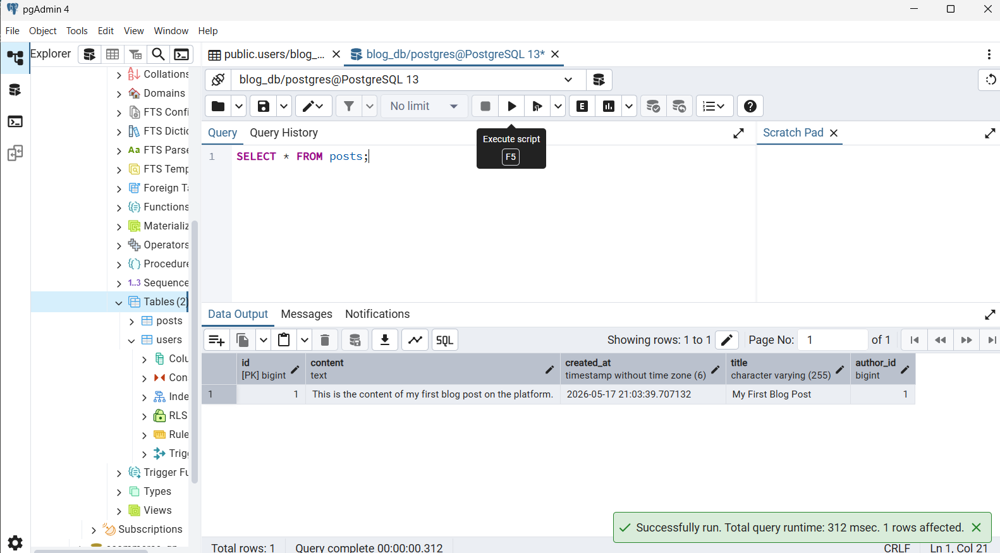

---

### Post Updated
Shows the post title and content after update in test 17.
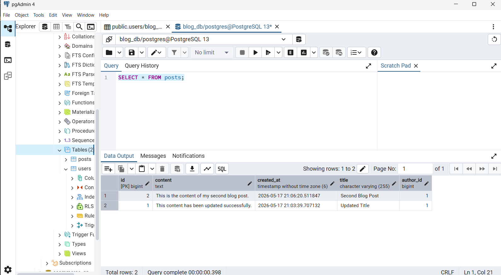

---

### Post Deleted
Shows posts table after deletion in test 24 — post is gone.
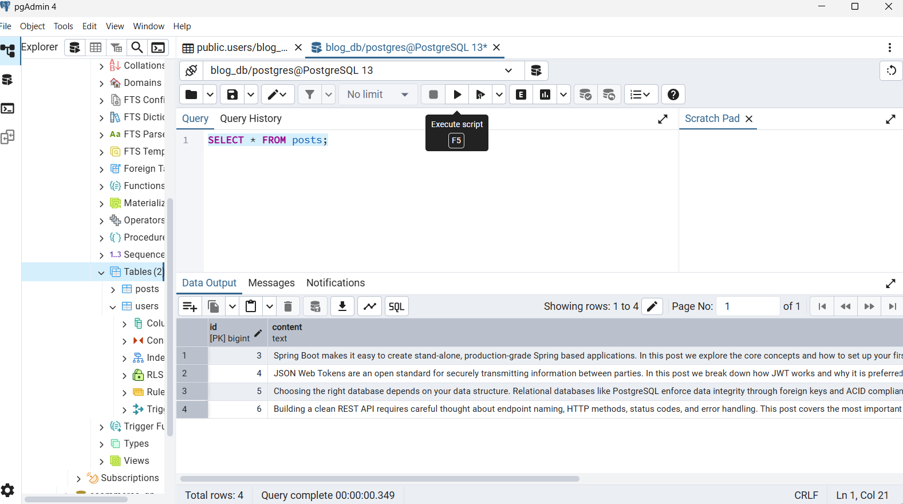